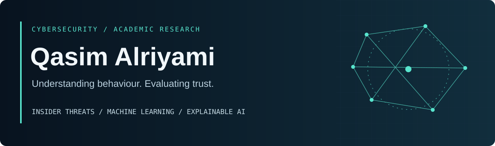

  

  <strong>PhD researcher · Faculty of Computing · Universiti Teknologi Malaysia</strong> 
  Insider threat detection · Explainable AI · Trustworthy evaluation

  <a href="https://alriyami7777-alt.github.io/">Academic website</a> &nbsp; / &nbsp;
  <a href="https://orcid.org/0009-0007-8081-9997">ORCID</a> &nbsp; / &nbsp;
  <a href="#publications">Publications</a> &nbsp; / &nbsp;
  <a href="#research-code">Research code</a>

---

### About me

I'm **Qasim Mohamed Muhanna Alriyami**, a PhD researcher at **Universiti Teknologi Malaysia (UTM)**. I study how machine learning can detect insider threats from behavioural evidence, and how to evaluate whether its predictions and explanations can be trusted.

My work connects **cybersecurity, temporal learning, and explainable AI**, with particular attention to rare behaviour, multi-source activity logs, data leakage, and performance beyond a single benchmark.

### Research focus

- **Insider threat detection** — learning from behavioural sequences and enterprise activity logs.
- **Temporal and sequence–ensemble learning** — connecting recurrent models, attention, and differentiable trees.
- **Cross-dataset generalisation** — testing what transfers across CERT, SPEDIA, and LANL.
- **Explainability and robustness** — examining explanation faithfulness and sensitivity to degraded inputs.
- **Evidence synthesis** — systematic reviews of machine learning, preprocessing, and agentic AI for cybersecurity.

### Publications

**2026 · IJACSA**  
**[Does It Generalize? A Cross-Dataset Study of Graph-Based Insider Threat Detection Beyond CERT](https://doi.org/10.14569/IJACSA.2026.0170991)**  
Qasim Mohamed Muhanna Alriyami and Mohd Murtadha Bin Mohamad. *International Journal of Advanced Computer Science and Applications*, **17**(9).  
[Publisher](https://thesai.org/Publications/ViewPaper?Volume=17&Issue=9&Code=IJACSA&SerialNo=91) · [Research code](https://github.com/alriyami7777-alt/crossdataset-insider-threat)

**INCoS 2014 · Conference paper**  
**[A Survey of Intrusion Detection Systems for Mobile Ad Hoc Networks](https://doi.org/10.1109/INCoS.2014.27)**  
Q. M. Alriyami, E. Asimakopoulou, and N. Bessis. *2014 International Conference on Intelligent Networking and Collaborative Systems*, pp. 427–432.  
2014 conference; the university record dates publication to 9 March 2015.

**2014 · ICCVE**  
**[Evaluation Criterias for Trust Management in Vehicular Ad-hoc Networks (VANETs)](https://doi.org/10.1109/ICCVE.2014.7297525)**  
Q. Alriyami, A. Adnane, and A. K. Smith. *2014 International Conference on Connected Vehicles and Expo*, pp. 118–123.

### Research code

- **[Cross-dataset insider threat detection](https://github.com/alriyami7777-alt/crossdataset-insider-threat)**  
  Code, protocols, and results accompanying the IJACSA paper on zero-shot transfer across CERT, SPEDIA, and LANL.
### How I approach research

**Respect chronology.** Keep future information out of earlier predictions.  
**Measure rare outcomes.** Examine precision–recall behaviour and threshold choices.  
**Test the limits.** Separate benchmark evidence from operational claims.  
**Make work traceable.** Share protocols, supporting materials, and research code where available.

---

I welcome academic discussions on insider threat detection, explainable security models, temporal learning, and systematic literature reviews.

**[Explore my academic website](https://alriyami7777-alt.github.io/)** · **[View my ORCID](https://orcid.org/0009-0007-8081-9997)**
